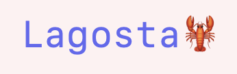

 
 
Lagosta is a tool to fight fraud faster.
At the moment it has a single feature: taking a set of UUIDs/IDs it fetches data from a database, shows a preview in the browser and then renders a docx template letter, which is sent to a slack channel.
It uses googlesheets to keep track of what UUIDs it reported, which keeps it simple.

It is written in Clojure and makes extensive use of Tailwind CSS and HTMX.
